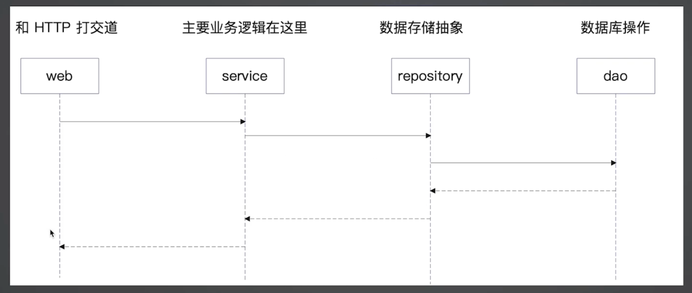
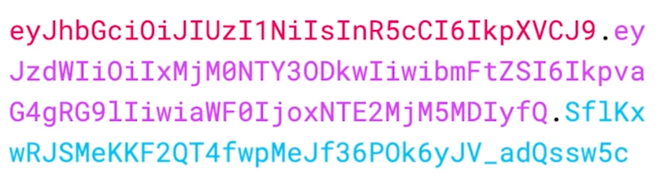
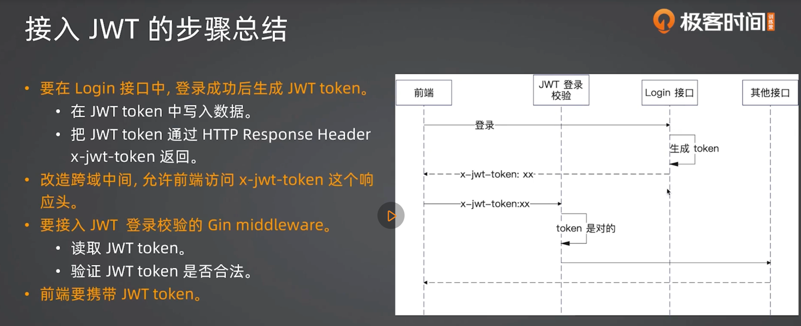
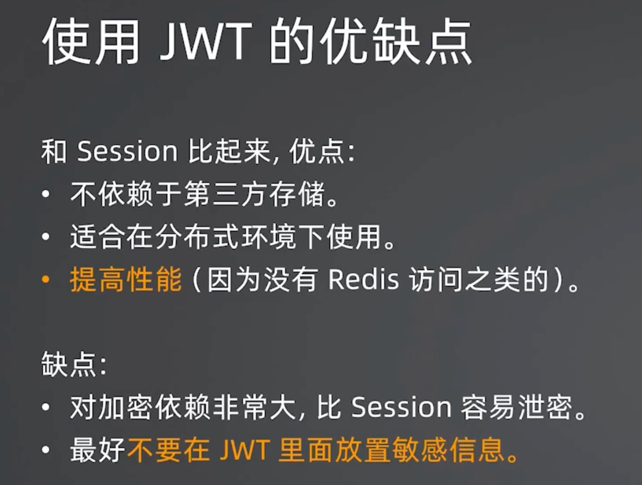

# Service - Repository - Dao 三层结构

- service: 代表的是领域服务, 一个业务的完整处理过程
- repository: 领域对象的存储(存储数据的抽象)
- dao: 数据库操作
    - domain: 领域对象
    - cache: 缓存

为什么有repository之后, 还要有dao?
repository是一个整体抽象, 塔里木既可以考虑用ES, 也可以考虑用MySQL, 还可以考虑用MongoDB. 所以他只代表数据存储, 但是不代表数据库.

service是干嘛的?
组合各种repository、domain, 偶尔也会组合别的service, 来共同完成一个业务功能.

domain是什么?
是业务在系统中的直接反映, 或者理解为一个业务对象, 有或者就是一个显示对象在程序中的反映.

校验邮箱和密码, 既可以在web, 也可以在domain.user, 也可以在service.user, 取决于怎么理解

# Cookie和Session

面试的时候要详细解释: 
- Cookie: 浏览器存储一些数据到本地就是Cookie, 就是存储在电脑上的键值对, 很不安全, 在golang的http.Cookie{}能看到
  - Domain: Cookie可以在哪些域名下用, 最小化原则(越少也好)
  - Path: Cookie可以在什么路径下同, 最小化原则
  - Max-Age和Expires: 过期时间, 只保留必要的时间
  - Http-Only: 必须设置为ture, 让浏览器的JS代码无法访问
  - Secure: 只能用于HTTPS协议, 生产环境必须为true
  - SameSite: 是否允许跨站发送Cookie, 尽量避免 
- Session: Cookie里只放不太关键的数据, 关键数据叫Session, 放在后端, 比如用Session登陆状态

Gin的Session插件使用分两步
- 在middleware里接入, 会帮忙从Cookie里拿到SessionId, 再根据SessionId找到Session
- 拿到Session之后就可以为所欲为了, 比如校验是否登陆

# JWT

- Header: 元数据, 描述这个token本身, 是一个json对象
- Payload: 数据内容, 是一个json对象
- Signature: 签名, 根据Header和Payload生成
- 

